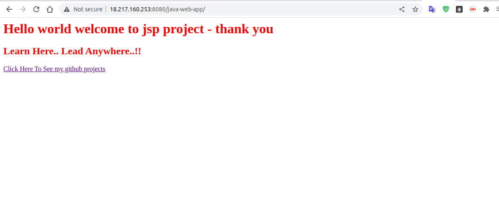
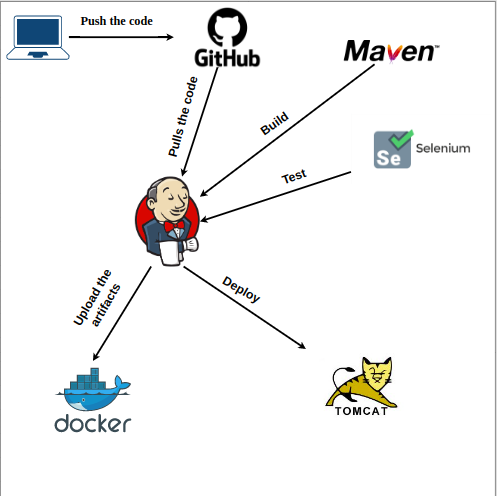

# Demo


## Brief
Jenkins CICD to Deploy on tomcat webserver and dockerize java webapp,  pushed it to dockerhub 



## Pre-requisits:
* Setup account in "AWS" [AWS Console](https://aws.amazon.com/console/)
   then create new user and download credentials in ~/.aws/credentials to use it in terraform.

* Install [Terraform](https://developer.hashicorp.com/terraform/tutorials/aws-get-started/install-cli) on your local machine.
* Install [Ansible](https://docs.ansible.com/ansible/latest/installation_guide/intro_installation.html) on your local machine to be able to run ansible commands.
* Install [Jenkins](https://www.jenkins.io/doc/book/installing/) on your machine.
## Tools Used
<p align="center">
<a href="https://aws.amazon.com/" target="_blank" rel="noreferrer"> 

</a>
<a href="https://www.terraform.io/" target="_blank" rel="noreferrer">

</a>
<a href="https://www.ansible.com/" target="_blank" rel="noreferrer">

</a> 
<a href="https://www.jenkins.io/" target="_blank" rel="noreferrer">

</a> 

<a href="https://tomcat.apache.org/" target="_blank" rel="noreferrer">

</a> 
</p>

## :rocket: Get started

### Cloning this project
```bash
$ git https://github.com/matriix00/Java-webapp-tomcat-Jenkins-AWS-Terraform-Ansible.git
```

##  Provision  AWS resources with Terraform


* First we should initiate terraform and download needed plugins for our providers as commands below .

```bash
$ terraform init 
```

* Second we should apply our terraform code on cloud provider (AWS).
```bash
$ terraform apply -auto-approve
```
* After creating our infra we need to store our tfstate
So We created aws s3 bucket and Dynamo-db with terraform to store our tfstate in a private safe place with lock strategy to protect from conflict with other users.

**Note:**
> You can see them in " init-backend.tf " file

* Now we will initiate our backend to replace it from local machine to aws s3 bucket.
```bash
$ terraform init 
```
**Note:**
> Don't forget to make myKey.pem file only readable by you running the code below before ssh to your ec2 instance.

```bash
$ chmod 400 myKey.pem 
```
**Note:**

>After building your infrastructure terraform will print out your instance public ip (jenkins-sever-ip), So make sure you will copy and don’t lose it.

##  Provision  AWS ec2 with Ansible

Now we are going to install jenkins on ec2 using ansible-playbook.

- Make sure that you installed amazon aws plugin to detect host automatically without creating inventory (host).  


```bash
$ ansible-galaxy collection install amazon.aws
```
- Now you can run command below to install tomcat 
```bash
ansible-playbook site.yml
```

After configuring your ec2-server you can change your manager password by change template in Ansible Templates your tomcat manager , So make sure you will not forget that .
 

### * Make sure you install these plugins on jenkins 
1- [Maven Integration plugin](https://plugins.jenkins.io/maven-plugin)

2- [Deploy to container Plugin](https://plugins.jenkins.io/deploy) 

* Now all you have to do , is to hit ip that you copied before with port 8080 followed by /java-web-app  to launch your web-app


*****************************************************************************************************
## * Hopefully I helped you with anything.
## Clean
- Please make sure to Destroy the resources once the testing is over to save the billing.
```bash
$ terraform destroy -auto-approve
```
## Contributing
Pull requests are welcome. For major changes, please open an issue first to discuss what you would like to change.

Please make sure to update tests as appropriate.